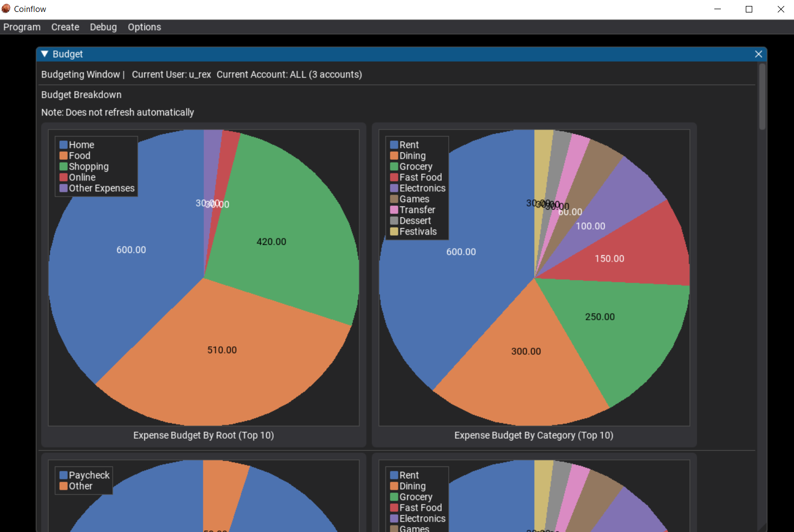

# Coinflow
 Python GUI Finance budgeting and auditing tool



---

# General Overview

Coinflow is a personal python based financial visualization, budgeting and auditing tool made by Rex Wang for my own personal finances. I found myself unsatisfied with the current offering of financial tools avalible to me and decided to write my own tailored to my own needs.

---

# Supported imports

Chase bank Credit / Checking / Savings

(Account / Transactions / Download as CSV)

---
# Features
Independent Windows
Users and accounts for better organization
Transactions table window
Running balance visualization
Budgeting and auditing 
Stock info (via yfinance)
rule based transaction classification
File backups

---

# Quickstart

Clone repo, run main.py

---

# Rules and categories

categories are stored at the categories.txt file by default,

each main category is written as

```
-Shopping
```

with the '-' indicatiing an expense, and 'Shopping' being the name of the category, you may also use '+' for income or '=' for neutral.

```
-Shopping
>Grocery
>Tools
```

Subcategories are written under the category label on a new line and have one '>' indicating it is a subcategory


---

Rules are broken up into Specific for a single transaction or a single day, Exact for exact match, partial for partial match, and default for all others. (ensure one default rule at min.)

The first two characters of each rule designates it's specificity and amount filter respectively with

's','e','p','d' specifying specificity and

'i','e','a' specifying income filter which it applies to (income, expense, all)

The match phrase is third and is usually matching the description, it is seperated from the category by semicolon

The category is what the rule will categorize the transaction as once matched,

Rules match only the first successful match starting at most and dropping to least specific.

```
eaZelle Payment From George:Personal - General
```

exact match, for all amounts, description of 'Zelle Payment From George' cooresponds to category 'Personal' subcategory 'General'

---

# Stocks

Last minute feature, stocks are read from the stocks.txt file with 1 valid ticker per line. These are used to generate the grid of stock matchstick graphs in the window using yfinance

---

# Config

Apart from the config avalible in the config window, please do not change anything else as it isn't extensively tested!

---

# File structure

assets - all images, screenshots etc

backup - a copy of the data folder made when the backup button is pressed, restore by manually copy-pasting it back

data - a folder storing all the transaction data for all users in all accounts, including budgets and config specific to each user and account

fonts - font files

categories.txt - main category file

config.json - wip config file, do not edit randomly

default_categories.txt - fallback category file

default_rules.txt - fallback rule file

rules.txt - main rules file

stocks.txt - stocks file

cfclassifier.py - main budget and classification scripts

cfparse.py - csv reading and object formatting scripts

cfstocks.py - yfinance helper scripts to get stocks

cfstructs.py - helper structs and classes like the logger

main.py - main program that draws the GUI and handles all callbacks once the data has been parsed

---

# Tech stack

(Major, nonstandard packages)

Languages - Python

GUI - Dearpygui